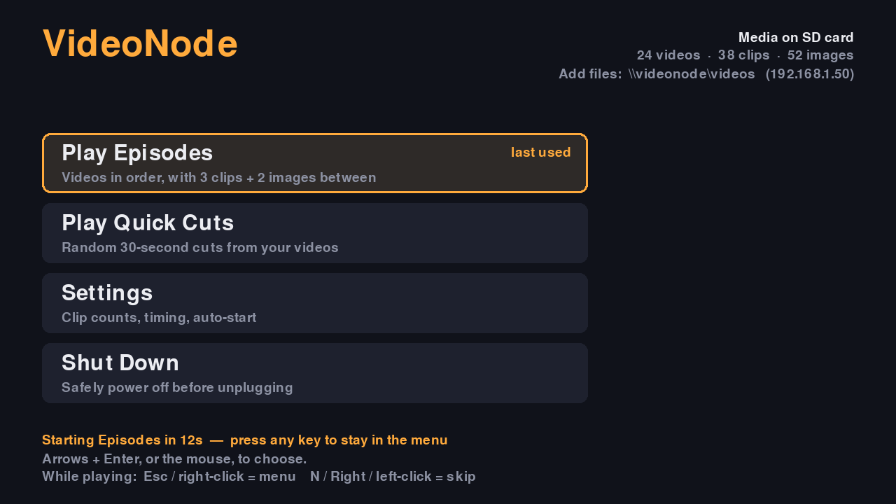
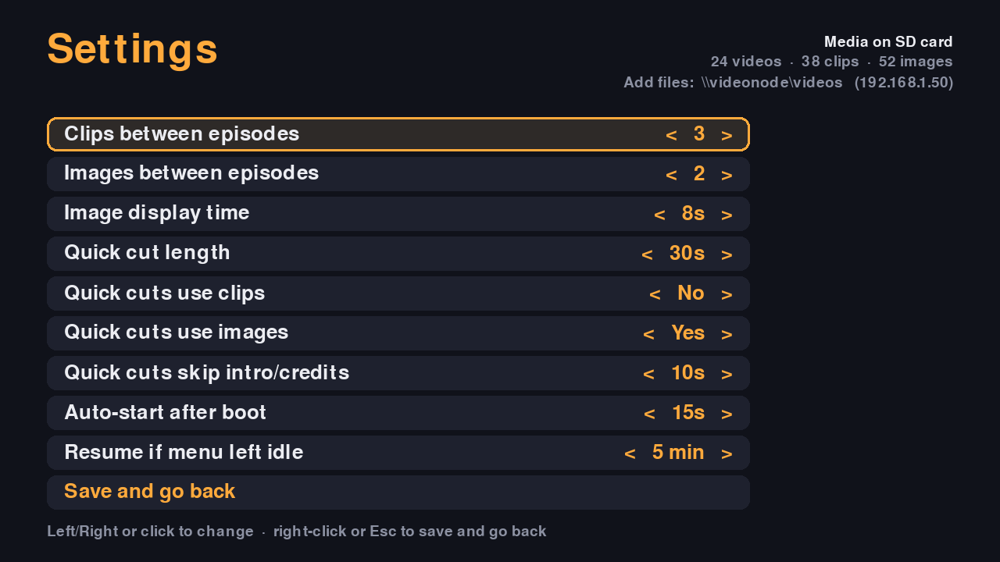

# VideoNode

A plug-it-in-and-it-plays offline video player for the Raspberry Pi 3 and 4. Connect it to a TV over HDMI, and it plays videos, short clips, and images from the SD card or a USB drive — no internet needed.



## Features

- **Two playback modes**
  - **Episodes** — plays your long videos in order, with a break of random short clips and images between each one. Remembers where it left off, even after a power cut.
  - **Quick Cuts** — an endless mix of random 30-second cuts (length adjustable) from random videos, optionally mixed with images.
- **On-TV menu** controlled with a USB keyboard and mouse: pick a mode, change settings, shut down safely. No desktop environment needed.
- **Appliance behaviour** — after boot it counts down and starts playing on its own, so no keyboard is needed day to day.
- **Easy media loading** — drag and drop over the network from Windows (`\\videonode\videos`), or plug in a USB drive.
- **Hardware-accelerated** H.264 playback with mpv, with auto-restart on failure.
- **Video prep tools** to convert any video into a Pi-friendly format and optionally burn in a themed border.

## Hardware

| | Raspberry Pi 3 (B / B+) | Raspberry Pi 4 |
|---|---|---|
| **Status** | Tested | Supported |
| **Power supply** | 5.1 V / 2.5 A micro-USB | 5.1 V / 3 A USB-C |
| **Best video format** | H.264, up to 1080p30 (720p recommended) | H.264, up to 1080p60 |
| **HDMI port** | The only one | **HDMI 0** (next to the USB-C power port) |

**Use a proper power supply.** An undervolted Pi slows itself down, which shows up as choppy video, and it risks corrupting the SD card. Phone chargers and thin cables are the usual cause. Check with `vcgencmd get_throttled`: `throttled=0x0` is good; anything else is a problem (see [Troubleshooting](#troubleshooting)).

You'll also want an SD card (16 GB+, or bigger if your media lives on it), and optionally a USB keyboard and mouse for the menu.

## Install

### 1. Flash the SD card

Using [Raspberry Pi Imager](https://www.raspberrypi.com/software/), choose **Raspberry Pi OS Lite (32-bit)** (Bookworm). The 32-bit image runs on both the Pi 3 and Pi 4; 64-bit works on both too.

Before writing, open **Edit Settings** and set:
- **Hostname:** `videonode`
- **Username and password** (any username works; `pi` is fine)
- **Wi-Fi** details, if you won't use Ethernet
- **Services → Enable SSH**

### 2. Run the installer

Boot the Pi, SSH in (`ssh pi@videonode.local`), then:

```bash
sudo apt update && sudo apt install -y git
git clone https://github.com/RichardA1/videonode.git ~/videonode-src
cd ~/videonode-src
bash install.sh
```

The installer:
- installs mpv, FFmpeg, pygame, and evdev
- installs VideoNode to `~/videonode` and creates `~/videos/{long,short,images}`
- creates `~/videonode/videonode.conf` (with extra playback tuning on a Pi 3)
- sets up the systemd service, so it starts on boot and restarts if anything fails
- sets up the Windows network share and asks for a share password
- sets up USB drive auto-mounting
- hides the console on the TV so only the menu and videos appear

It then offers to reboot. After the reboot, the menu appears on the TV.

Options: `--no-samba`, `--no-usb`, `--no-kiosk` (keeps the login prompt on the TV).

### Updating

```bash
cd ~/videonode-src && git pull && bash install.sh
```

Your settings are never overwritten. New defaults are written to `videonode.conf.new` for comparison.

## Adding media

VideoNode looks for three folders:

```
videos/
├── long/     full-length videos, played in filename order in Episodes mode
├── short/    short clips (bumpers, promos) played at random between episodes
└── images/   photos and graphics (.jpg .png .webp .bmp .gif)
```

Long videos play in **filename order**, so prefix them to control the sequence: `01_pilot.mp4`, `02_second.mp4`, and so on.

**From Windows**, open `\\videonode.local\videos` in File Explorer. To map it as a drive letter:

```powershell
net use V: \\videonode.local\videos /user:pi /persistent:yes
```

Files show up in the rotation about 30 seconds after they finish copying.

**From a USB drive**, put the same three folders inside a top-level `videos` folder on the drive. The drive is mounted **read-only** (so it's safe to unplug at any time) and **takes priority** over the SD card while it's plugged in. FAT32, exFAT, NTFS, and ext4 all work.

**Over SSH** (Mac/Linux): `scp *.mp4 pi@videonode.local:~/videos/long/`

## Using it

| Where | Keys / mouse | Action |
|---|---|---|
| Menu | Arrows + Enter, or click | Choose |
| Menu | Esc / right-click | Back |
| Settings | Left/Right, click (left third = down), scroll wheel | Change a value |
| During playback | **Esc**, Q, Backspace, or **right-click** | Back to the menu |
| During playback | **N**, Right arrow, Space, or **left-click** | Skip to the next item |

After boot, the menu starts your last-used mode after 15 seconds unless you press a key. If the menu is left idle for 5 minutes, playback resumes. Both timers are adjustable in Settings.

Always use **Shut Down** in the menu before unplugging, and wait for the Pi's green light to stop flashing.



## Settings

Most settings can be changed from the on-screen **Settings** menu. Everything is in `~/videonode/videonode.conf`, which you can also edit from Windows at `\\videonode.local\videonode-config`. Each setting is explained in the file. Changes take effect the next time playback starts from the menu, or after `sudo systemctl restart videonode`.

Commonly changed settings:

| Setting | Default | What it does |
|---|---|---|
| `num_short_clips` / `num_images` | 3 / 2 | Items in each break between episodes |
| `image_seconds` | 8 | How long each image is shown |
| `sample_seconds` | 30 | Quick Cuts length |
| `sample_margin` | 10 | Seconds skipped at the start/end of videos in Quick Cuts |
| `autostart_seconds` | 15 | Boot countdown (0 = stay in the menu) |
| `idle_resume_seconds` | 300 | Resume after this long idle in the menu (0 = never) |
| `ui` | yes | `no` = no menu, play straight away |
| `audio_device` | (blank) | Set this if there's no sound from the TV |

## Preparing videos

The Pi plays H.264 MP4s best. Other formats (HEVC/H.265, VP9, AV1, 10-bit, 60 fps) may stutter or not use hardware decoding, especially on a Pi 3. The `tools/` folder has batch converters that run on your PC (not the Pi) and need [FFmpeg](https://ffmpeg.org/download.html) (on Windows: `winget install Gyan.FFmpeg`).

**Windows (PowerShell):**

```powershell
.\tools\convert.ps1 -InputDir C:\Videos\raw -OutputDir C:\Videos\ready
.\tools\convert.ps1 -InputDir raw -OutputDir ready -Height 1080
```

**Mac / Linux:**

```bash
bash tools/convert.sh raw ready
bash tools/convert.sh -h 1080 raw ready
```

Output is 720p by default (use 1080 on a Pi 4), with 50/60 fps sources halved to 25/30 fps. Already-converted files are skipped, so you can rerun it after adding new videos.

If PowerShell refuses to run the script, allow local scripts once with `Set-ExecutionPolicy -Scope CurrentUser RemoteSigned`.

### Themed border

Create a 1920×1080 PNG with decorative edges and a **transparent middle**, then burn it into your videos:

```powershell
.\tools\convert.ps1 -InputDir raw -OutputDir ready -Border frame.png -Inset 6
```

```bash
bash tools/convert.sh -b frame.png -i 6 raw ready
```

`-Inset` / `-i` shrinks the video by that percent on each side, so it sits inside the frame instead of underneath it. Match it to your PNG's border thickness.

## Troubleshooting

View the logs:

```bash
journalctl -u videonode -b      # since boot
journalctl -u videonode -f      # live
```

**Choppy video**
1. Check power: `vcgencmd get_throttled`. `0x50005` means undervolted **right now**; `0x50000` means it happened earlier. Fix the power supply first; nothing else will help much until you do.
2. Check the file: `ffprobe -v error -select_streams v:0 -show_entries stream=codec_name,pix_fmt,width,height,r_frame_rate FILE`. You want `h264`, `yuv420p`, at most 1920×1080, and at most 30 fps (60 on a Pi 4). If not, convert it with the tools above.
3. Set the TV output to 720p, which halves the GPU's work: add ` video=HDMI-A-1:1280x720@60` to the end of `/boot/firmware/cmdline.txt`. On a Pi 4 connected to a 4K TV, use `1920x1080@60`; 4K output is too heavy.

**No sound**: run `mpv --audio-device=help`, find the HDMI entry (it contains `vc4hdmi`), and set `audio_device` in the config to it, e.g. `alsa/plughw:CARD=vc4hdmi,DEV=0`. On a Pi 4, use the one for HDMI 0.

**The menu doesn't appear** (videos play straight away): the logs will say `Menu unavailable`, with the reason. Check that `python3-pygame` is installed. The player falls back to playing without the menu so the TV is never blank.

**`videonode.local` isn't found from Windows**: use the Pi's IP address instead (shown in the menu's top-right corner, or run `hostname -I`).

**USB drive isn't used**: check `journalctl -t videonode-usb` and `findmnt /media/usb`. The media must be in a `videos` folder at the top of the drive.

**Shut Down says it failed**: rerun `bash install.sh`, which sets up the permission it needs.

**Getting back to a normal console**: `sudo systemctl stop videonode` stops the player until the next boot. `bash uninstall.sh` removes VideoNode's system changes, but keeps your media and settings.

## How it works

- `videonode.py` is a single Python script. The menu is drawn with pygame directly on the display (KMS/DRM, no X11 or Wayland). Starting playback hands the display to mpv, and returning to the menu takes it back.
- While mpv is playing, keyboard and mouse input is read directly with evdev, and skip commands go to mpv over its IPC socket.
- Each break between episodes, and each batch of Quick Cuts, is sent to mpv as one playlist, so transitions within it are seamless.
- Media folders are rescanned every cycle, so new files and USB drives are picked up without a restart. Files modified in the last 30 seconds are ignored, so half-copied files never play.
- Shuffle bags make sure every clip, image, and video plays once before any repeats.

## Uninstall

```bash
cd ~/videonode-src && bash uninstall.sh
```

This removes the service, network share, USB auto-mount, and console changes. Your media (`~/videos`) and settings (`~/videonode`) are kept.

## Roadmap

- Pi Zero 2 W and Pi Zero W support
- Faster boot (less time from power-on to the menu)
- Optional live border overlay without re-encoding

## License

[MIT](LICENSE)
